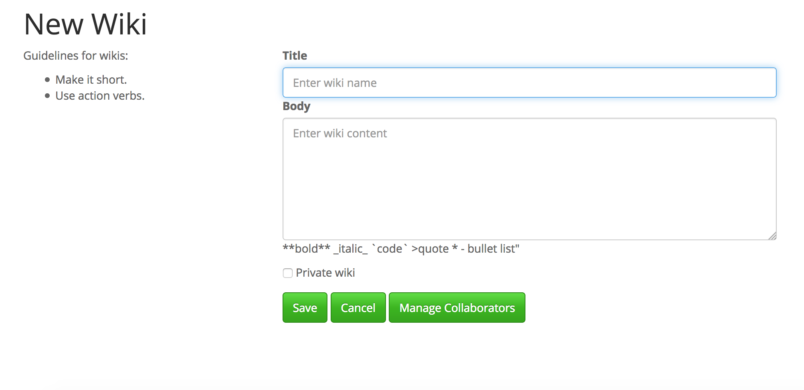

# For Foragers 

Powered by Ruby on Rails 4.2.5 and Bootswatch

## User Story:
Create Markdown-based wikis, public wikis are free to be edited by all users, and private wikis are only able to be updated by designated collaborators.

Creation of private wikis, however, is a privilege reserved for premium users, who have paid the $15 upgrade fee.  

Admins have authority to CRUD all wikis
Wiki content is markdown-based and users can see a live preview of their content as they create or edit it.

### Running the application:

0. clone
1. terminal: `rails s`
2. browser: `localhost:3000`
